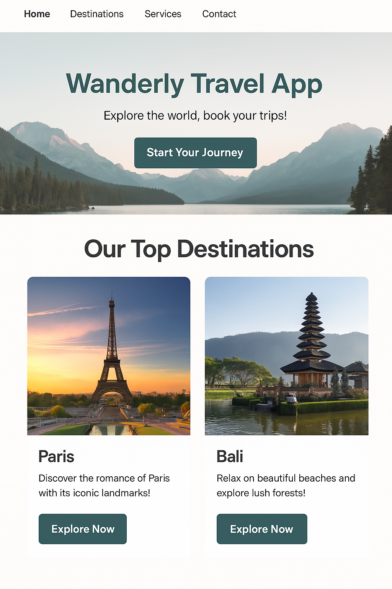

# 🌍 Wanderly Travel App

Wanderly is a sleek and modern React-based travel website that showcases beautiful destinations, allows users to explore travel packages, and makes booking a breeze. This project emphasizes clean UI/UX, responsiveness, and modular React component design.

## 📸 Preview

## 🚀 Features

- 🌐 **Single Page Application** using React Router
- ✨ **Modern UI/UX** with clean, responsive layout
- 📱 Fully **responsive design** for mobile and desktop
- 🧭 **Multi-page structure**: Home, Destinations, About, Contact, Booking
- 📩 Reusable components: Navbar, Footer, Cards
- 💬 Social media integration in the footer

---

## 🧩 Pages Included

- `Home` – Introduction and featured travel content
- `Destinations` – Gallery of travel destinations
- `About` – Information about Wanderly
- `Contact` – Basic contact form (non-functional placeholder)
- `Booking` – Booking form (static UI only)

---

## 🛠️ Tech Stack

- **Frontend**: React, JSX, CSS
- **Routing**: `react-router-dom`
- **Icons**: `react-icons`

---

## 📁 Folder Structure

